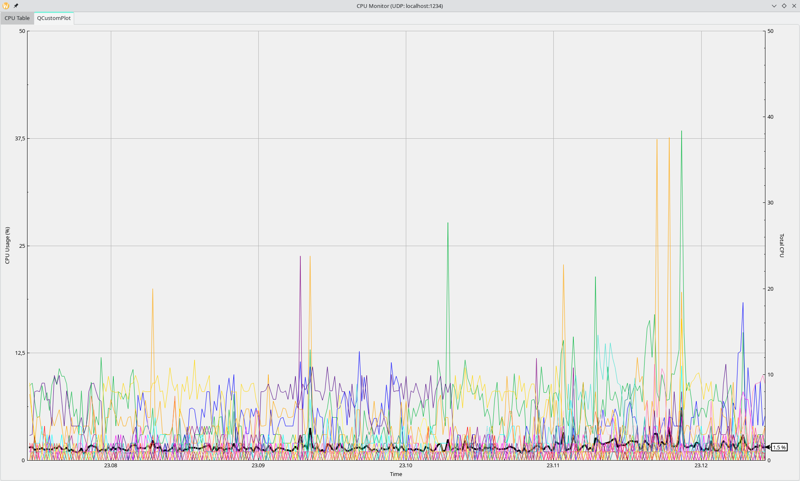
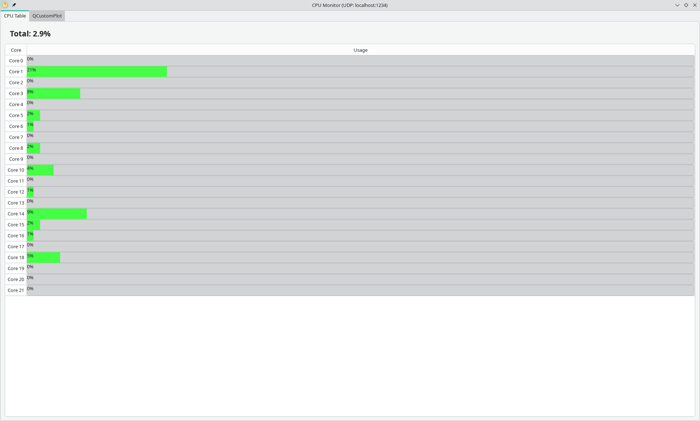

# CPU-Server

Приложение для мониторинга загрузки процессора в реальном времени с графическим интерфейсом, построенным на Qt и QCustomPlot.

## Основная функциональность

- **Получение данных по UDP**: Принимает данные о загрузке CPU через UDP сокет на localhost:1234
- **Табличное представление**: Отображает загрузку каждого ядра CPU в виде таблицы с прогресс-барами
- **Графическое представление**: Строит графики загрузки CPU с использованием библиотеки QCustomPlot
- **Динамическое обновление**: Обновляет данные в реальном времени с частотой 1 раз в секунду
- **Визуальная индикация**: Использует цветовую дифференциацию для разных ядер

## Возможности графиков

- Отдельные графики для каждого ядра CPU
- Цветовая дифференциация ядер
- График общей средней загрузки CPU
- Автоматическое масштабирование оси Y
- Индикатор текущего значения общей загрузки на правой оси Y

## Используемые библиотеки

- **Qt 5/6** (минимальная версия Qt5):
- **QCustomPlot 2.1.1** - построения графиков https://www.qcustomplot.com/index.php/download

## 🚀 Сборка проекта

#### Linux/macOS:

```bash
mkdir -p build && cd build
cmake -DCMAKE_BUILD_TYPE=Release ..
cmake --build . --parallel $(nproc)

# Или просто (CMake сам определит количество ядер)
cmake --build . --parallel

# Запустите приложение
./cpu-server
```

## Выполнение приложения

Приложение ожидает `cpu-client` получения данных о загрузке CPU в формате:
```
Total: <float>%
Core <N>: <float>%
Core <N+1>: <float>%
...
Core <M>: <float>%
```



# Улучшения:

02.02.2026
---

Исправления безопасности и улучшения читабельности кода

### 1. **Безопасность (критические исправления)**
- ✅ **Валидация UDP-пакетов**: Добавлена проверка размера датаграмм с лимитом `MAX_UDP_DATAGRAM_SIZE = 4096`
- ✅ **Проверка границ массивов**: Исправлены потенциальные выходы за границы векторов во всех циклах
- ✅ **Защита от отрицательных значений**: Функция `roundToTen()` теперь проверяет и обрабатывает отрицательные значения
- ✅ **Null-safe указатели**: Добавлены проверки `qobject_cast` перед использованием
- ✅ **Валидация формата данных**: Проверка структуры входящих UDP-сообщений
- ✅ **Обработка неполных данных**: Корректная обработка частично прочитанных датаграмм

### 2. **Улучшение читабельности кода**
  
- ✅ **Вынос создания цветов**: Метод `getDefaultCoreColors()` вынесен в отдельную функцию для лучшей организации
- ✅ **Комментарии для сложной математики**: Добавлены подробные пояснения в `updateYAxisRange()`:
- Объяснение расчета максимального значения оси Y с запасом
- Логика округления до десятков
- Расчет шага делений оси (5% от диапазона)

### 3. **Рефакторинг и чистка кода**
- ✅ **Переименование переменных**: `cpuTag` → `totalCpuIndicator` (более описательное имя)
- ✅ **Удаление неиспользуемых переменных**: Убран `mainLayout`, который не использовался
- ✅ **Использование STL алгоритмов**: `std::accumulate` вместо ручного суммирования
- ✅ **Логирование**: Добавлена категория `cpuMonitor` для отладки и мониторинга ошибок
- ✅ **Константные выражения**: `constexpr` для констант времени и размеров

---
